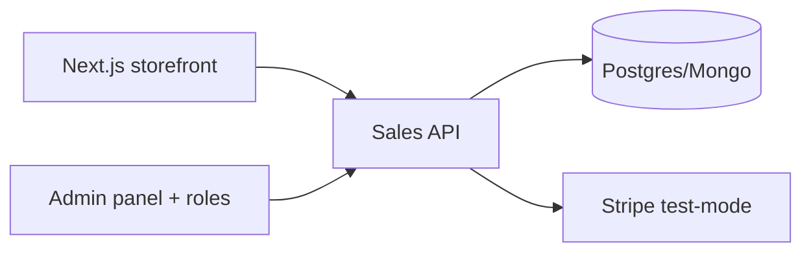

# FrancosCommerce — Full-stack E-commerce


A complete e-commerce: storefront + cart + **Stripe test-mode checkout** + orders,
inventory and an **admin panel with roles** — full transactional domain, from
browsing to fulfillment.

> 🇧🇷 E-commerce completo: vitrine + carrinho + **checkout Stripe (modo teste)** +
> pedidos, estoque e **painel administrativo com papéis** — o domínio transacional
> inteiro, da navegação ao pós-venda.

## Why this project matters

E-commerce is the densest business domain a junior/mid dev can show: cart state,
checkout idempotency, stock race conditions, order states. This project merges two
of my working repos — the Next.js storefront
([doben_eccomerce_store](https://github.com/FrancosCorporation/doben_eccomerce_store),
boot HTTP 200) and the .NET sales API
([api_loja_venda_app](https://github.com/FrancosCorporation/api_loja_venda_app), 0 build errors)
— following the UX standards of the best open-source commerce front-end.

## Features (roadmap)

- [ ] **M1** — Storefront, product catalog, cart, Stripe test checkout, persisted orders
- [ ] **M2** — Admin panel: products, inventory, orders, customer search, roles
- [ ] **M3** — E2E purchase-flow tests, catalog seed, demo deploy

## Architecture



## Quick start (planned)

```bash
docker compose up   # storefront + api + db
```

## Built with

- [vercel/commerce](https://github.com/vercel/commerce) (MIT, 14k⭐) — storefront
  patterns: product pages, cart UX, SEO
- My working foundations: doben_eccomerce_store (Next.js storefront),
  api_loja_venda_app (.NET sales API), api_django_vendas (domain patterns)

## License

MIT — Rodolfo Franco ([FrancosCorporation](https://github.com/FrancosCorporation))

---

### 🇧🇷 Sobre (PT-BR)

E-commerce full-stack unificando meus projetos funcionais (loja Next.js + API de vendas
.NET) com os padrões de UX do vercel/commerce. Checkout Stripe em modo teste, estoque,
pedidos, painel admin com papéis e testes e2e do fluxo de compra. Roadmap de 3 milestones
no PROJETOS_RH.md do workspace.
